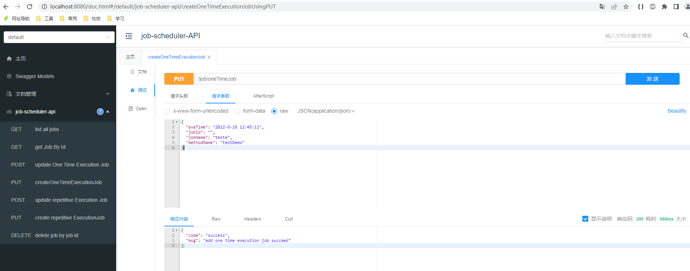
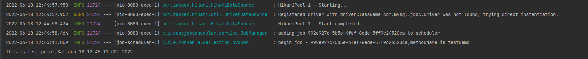
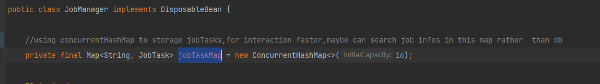

# easy-job-scheduler
job-scheduler 
It was using springboot taskscheduler and Java Reflection to implement an easy job scheduler.
project needs jdk8 and mysql

**GET START**
runing job_scheduler.sql to init database,
runing EasyJobSchedulerApplication.java to start project , visit http://localhost:8080/doc.html#/home to get API 

**DEMO**
to runing an custom job，you need to define this method in JobMethods.java and note down your method name

1.send a request to create a repetitive job

The background will call the task cyclically according to the method name

2.send a request to create a one time execution job

**COMMENTS**
Regardless of whether the execution is successful or timeout, the scheduled task will retry the execution.
If we want to make the interaction faster,maybe can search job infos in  jobTaskMap rather than db,please refer to 

